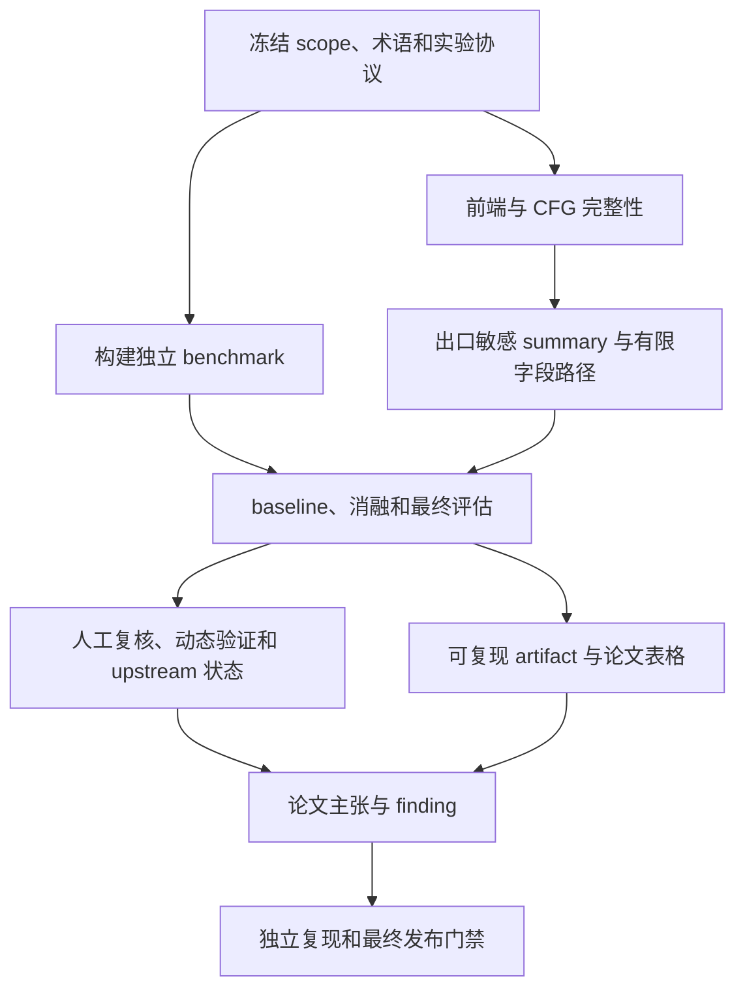

# SE-EOD 项目闭合计划

> 状态基线：2026-07-18
>
> 适用范围：当前仓库主线及其 Linux 文件系统实验制品
>
> 文档目的：定义“还要做什么、做到什么程度、用什么证据证明完成”，直到项目在工程、实验、论文和复现四个层面同时闭合。

本文档是未来工作的主验收清单。`docs/PROJECT_ARCHITECTURE.md` 负责描述当前代码事实，`PAPER_ROADMAP.md` 保留历史进度和投稿任务背景；二者与本文档冲突时，应先核对代码和实验产物，再更新本文档中的状态，不能仅凭计划文字宣布能力已经完成。

当前执行切片（2026-07-18）：项目所有者决定先完善分析器代码，按 G1--G5（switch CFG、编译前端、callee effect、有限字段路径、predecessor witness）顺序推进；benchmark、baseline、正式评估和论文工作暂缓。具体代码交接与完成门禁见 [`../PROJECT_HANDOFF.md`](../PROJECT_HANDOFF.md)。这项阶段性顺序调整不删除后续闭合任务。

---

## 1. “项目闭合”的定义

SE-EOD 不能以“代码能运行”或“找到了一些候选”作为完成标准。项目闭合要求以下六个循环均能从输入走到可审计结果，并能把失败反馈回前一阶段。

| 闭环 | 输入 | 输出 | 闭合条件 |
|---|---|---|---|
| 语义闭环 | 带真实编译上下文的 Linux C 代码 | 资源义务候选、路径 witness、不确定性 | 每个结论可追溯到源码、CFG、资源实例和 effect；不支持的语义被量化而非静默忽略 |
| 配置闭环 | 源码中观察到的生命周期 API | reviewed contract、漂移报告、回归用例 | API 新增、改名、wrapper 和配置冲突有稳定发现、审查、升级和版本化流程 |
| 评估闭环 | 独立正例、候选样本和冻结划分 | Precision、Recall、F1、P@K、消融和误差分类 | 标签独立、无数据泄漏、指标可由脚本重算 |
| 缺陷闭环 | 高置信候选 | 人工结论、动态证据、补丁或历史证据 | 每个最终 finding 有唯一状态、证据等级和可访问材料，不把 submitted 当 accepted |
| 复现闭环 | 干净环境和公开源码版本 | 相同核心表格、候选和 manifest | 第三方按一份说明可完成安装、分析和结果核验 |
| 论文闭环 | 方法、实验、finding 和局限 | 可审查的论文与 artifact | 每项主张有对应算法、实验、表格和威胁分析，且不超出支持范围 |

只有六个闭环全部通过，项目才达到“正式论文和公开研究制品完成”。其中任何一项未通过，都必须明确标记为原型、pilot 或未独立验证结果。

---

## 2. 冻结研究范围

### 2.1 核心问题

首篇完整工作的核心问题冻结为：

> 在 Linux 文件系统函数的错误出口上，判断该路径建立的资源义务是否仍未解除，并为每个结论保留出口条件、资源身份、跨函数 effect、数量语义和不确定性来源。

核心候选类型只包括：

- `missing_cleanup`：错误出口仍持有至少一个独立资源义务；
- `partial_cleanup`：同一路径建立了多个义务，部分已解除但至少一个仍未解除。

### 2.2 扩展能力

以下能力可以保留在工具中，但必须在实验和论文中与核心资源义务结果分开报告：

- `error_swallowed`；
- `stale_error_after_retry`；
- API drift audit；
- protocol、history、manual 和 LLM ranking；
- 自动修复建议。

它们不得用于扩大核心算法主张，也不得把排序证据反向写成 `RELEASED`、`TRANSFERRED` 或 ground truth。

### 2.3 首篇工作的明确非目标

以下内容不是项目闭合的前置条件：

- 完整、通用、字段敏感且上下文敏感的全程序 points-to；
- 对任意 C 程序完备的 SSA；
- 一般 SMT 符号执行；
- 整个 Linux 内核和所有 Kconfig 组合；
- GUI、dashboard 或自动生成可合并补丁；
- 将 ranking 分数解释为 bug 概率；
- 让 LLM 决定静态候选是否存在。

这些非目标必须写入论文的 scope 和 threats，避免“未实现通用能力”等同于“项目未闭合”。闭合要求的是支持片段定义清楚、片段内行为可验证、片段外风险可量化。

---

## 3. 当前基线与真实缺口

### 3.1 已具备的基础

当前仓库已经具备：

- tree-sitter 函数抽取和函数内 CFG；
- `if`、循环、`goto`、`return`、`break`、`continue` 的基本控制流；
- 有界析取状态传播、join 和 widening；
- acquire validity、资源实例、局部 symbol ID、multiplicity/cardinality 和 aggregate membership；
- release、transfer、escape、must/may 和出口 guard；
- 跨函数 summary 不动点、SCC provenance 和收敛降级；
- obligation 级候选、witness、quarantine 和 uncertainty provenance；
- 配置审计、API 漂移审计和静态语义/排序证据隔离；
- Linux 多版本、多文件系统实验 runner 和 manifest；
- 30 条 ext4 v6.8 pilot 的第一轮标注及初步指标；
- 历史修复、动态验证和已提交补丁等 finding 材料。

### 3.2 阻止闭合的缺口

| 编号 | 缺口 | 为什么阻止闭合 |
|---|---|---|
| G1（已完成） | 普通 `switch/case/default` 已有真实 CFG 语义；GNU case range/prelude 继续精确降级 | case/default/no-match/fallthrough 和嵌套 break/continue 已闭合，残余风险转入前端 G2 |
| G2 | 没有 Kbuild/Clang 编译上下文 | 宏、inline、条件编译、类型和 GNU C 语义覆盖无法可靠说明 |
| G3 | 一般 callee CFG 的 success/error effect 不能自动总结 | reviewed seed 和简单 wrapper 之外仍有大量跨函数误报 |
| G4 | 字段路径和 alias 仍过粗 | `obj->field`、容器成员和 out-parameter 的资源身份容易丢失 |
| G5 | witness 仍是 representative trace | join、widening 和跨路径状态的来源不能完全重建 |
| G6 | 没有独立冻结的 gold benchmark | 现有 pilot 不能支持论文级 Precision/Recall 结论 |
| G7 | 缺少同一数据上的正式 baseline 和 B0--Full 消融 | 无法证明复杂设计比简单名称/CFG 扫描更有效 |
| G8 | 依赖、CI、artifact 和公开证据不完整 | 外部研究者无法从干净环境复现核心结论 |
| G9 | related work 和贡献边界尚未冻结 | 容易与 Hector、ErrHunter、EPEX、EH-Miner、InferROI 重复表述 |

---

## 4. 总体依赖关系



必须先冻结实验协议，再继续使用 benchmark 反馈修改规则。前端和 benchmark 可以并行，但最终测试集在冻结后不得参与开发。

---

## 5. 工作流 A：研究主张与术语闭合

### A-01 冻结主张

工作：

- 将论文主张固定为“错误出口资源义务分析”，不声称首次检测错误处理资源泄漏；
- 将出口敏感 effect、不确定性 provenance、cardinality 和证据隔离定义为待实验验证的设计贡献；
- 明确工具是 supported-fragment conservative candidate analysis，不宣称对 Linux C 完全 sound；
- 为每个贡献写出一个可证伪的问题和对应实验。

产物：

- `docs/research/CLAIMS.md`；
- `docs/research/RQ_PROTOCOL.md`；
- 论文 contribution 与 scope 草稿。

验收：

- 每项主张都能指向一个实现模块、一个 benchmark 指标和一项消融；
- 删除任何无法由当前或计划实验验证的“首次”“完整”“概率”“确认”表述。

### A-02 冻结术语和证据状态

必须统一以下概念：

- `path`、`candidate`、`obligation`、`bug cluster`；
- `true_candidate` 与 `true_bug`；
- `historical_fixed`、`source_confirmed`、`dynamically_reproduced`、`patch_submitted`、`reviewed_by`、`upstream_accepted`；
- `high/medium/low analysis confidence` 与 `E0--E5 evidence level`。

验收：

- CSV、JSONL、benchmark、finding 表和论文使用相同词义；
- 一个 bug 的多条路径或多个 obligation 能聚合为一个 cluster，同时保留原始 candidate ID；
- 外部状态未变化时，不因时间推移自动升级证据等级。

---

## 6. 工作流 B：编译前端和 CFG 闭合

### B-01 完整实现 `switch/case/default` CFG `P0` — 已完成

完成证据：`src/cfg.py::_switch_statement()`、`tests/test_cfg.py`、`tests/test_cfg_resource_flow.py`、`tests/fixtures/switch_cfg_linux_ext4_v6_14.json` 和 `tests/test_switch_cfg_linux_golden.py`。普通 switch 不再因节点类型降级；GNU case range/prelude 保留精确 unsupported range。

语义要求：

- switch 条件只求值一次；
- 每个 `case` 和 `default` 有独立入口边；
- 支持多个 case 共享语句体；
- 保留 case fallthrough；
- `break` 指向最近的 switch 出口；
- 循环内 switch、switch 内循环和嵌套 switch 的 break/continue 目标正确；
- `goto` 跨 case、跳出 switch 和 label 解析不被破坏；
- 没有 `default` 时保留“无 case 命中”的出口；
- case 条件暂时无法求值时保留多分支，而不是任选一条。

测试要求：

- 单 case、多 case、default、fallthrough、共享 case、嵌套 switch；
- switch 中 acquire/release；
- case 中 goto cleanup；
- switch 与 loop 的 break/continue 组合；
- 至少选取 10 个真实 Linux 文件系统函数做 golden CFG 回归。

完成标准：

- `switch_statement`、`case_statement` 不再仅因节点类型进入 `unsupported_nodes`；
- golden CFG 的块、边、出口和资源状态全部通过；
- 对仍不支持的 GNU case range 等语法明确隔离并计数。

### B-02 建立统一前端 IR `P0` — 已完成

完成证据：`src/frontend/model.py`、`src/frontend/tree_sitter_frontend.py`、`tests/test_frontend_ir.py` 和 `tests/fixtures/frontend_ir_v1_golden.json`。当前 schema v1 已表达 translation unit/compile-command slot、function、generic node、symbol/type spelling、direct/indirect call、syntactic access path、diagnostic 和 CFG；主流程已经过 tree-sitter adapter，候选/summary parity 无差异。真实 compile command 和 typed/macro facts 仍属于 B-03/B-04。

在继续接入 Clang 前，先定义 tree-sitter 与 Clang 都必须输出的内部接口：

- translation unit 和 compile command 身份；
- 函数、参数、局部变量和类型摘要；
- statement/expression kind；
- 直接调用、间接调用和可能目标；
- 规范化 lvalue/access path；
- CFG block、edge、source range 和 edge condition；
- macro expansion/source spelling 位置；
- parser/frontend quality 和 unsupported feature。

建议将前端接口独立到 `src/frontend/`，资源分析只依赖统一 IR，不直接依赖 tree-sitter 节点 API。

完成标准：

- 现有 tree-sitter 测试通过统一 IR 重跑且候选差分可解释；
- 前端切换不需要复制一套资源状态传播器；
- IR schema 有版本号和序列化测试。

### B-03 接入 Kbuild compile commands `P0`

工作：

- 为选定 Linux tag 固定 `.config`、架构和编译器版本；
- 使用内核构建系统生成实际对象文件对应的 `compile_commands.json`；
- 记录每个 translation unit 的 include、define、target 和语言选项；
- 将未进入当前 Kconfig 构建的 `.c` 文件单独列为 uncovered，而不是与已分析文件混合；
- 保存源码 commit、config hash、compiler hash 和 compile database hash。

完成标准：

- 四个目标文件系统中进入论文实验的 translation unit 都能映射到唯一 compile command；
- 缺失或失败的 translation unit 有机器可读清单；
- 同一 manifest 可以在干净 Linux/容器环境重建 compile database。

### B-04 实现 Clang compiled mode `P0`

最低闭合能力不是完整重写 LLVM 分析，而是：

- 使用真实 compile command 完成预处理和类型检查；
- 提取 typed function/call/field/access-path 信息；
- 获取或导出函数内 CFG；
- 将源码位置映射回 spelling/expansion location；
- 识别 inline/helper、宏包装 API 和函数指针类型；
- 将结果转换为 B-02 的统一 IR；
- 无法导出的函数自动降级到 tree-sitter 或 quarantine，并保留原因。

可以通过固定版本的 Clang LibTooling exporter 实现，不要求把 Python 主程序整体迁移到 C++。

完成标准：

- 对冻结的 frontend parity corpus，Clang 与人工预期的函数、调用和 CFG 事实一致；
- compiled mode 的失败率、降级率和宏来源均有统计；
- 论文主实验使用 compiled mode，tree-sitter 结果只作为速度/降级对照；
- 不再把“解析成功”错误等同于“编译语义完整”。

### B-05 前端覆盖率门禁 `P0`

每次主实验必须输出：

- 目标 `.c` 文件数、进入 Kbuild 的 translation unit 数；
- compile command 成功率；
- Clang AST/CFG 成功率；
- tree-sitter 降级函数数；
- unsupported node/range 数；
- 主候选与 quarantine 候选分别受哪些前端问题影响。

覆盖率分母必须在实验协议中提前冻结。不能只报告“成功分析的函数”，从而隐藏未进入分析的代码。

---

## 7. 工作流 C：资源语义闭合

### C-01 自动推导出口敏感 callee effect `P0`

目标：从一般 callee CFG 推导资源在不同出口类别上的 effect，而不只依赖 reviewed seed 或简单 wrapper 模式。

最低支持范围：

- 将 callee return state 分类为 success、error、unknown；
- 分别计算参数、返回值和 out-parameter 的 acquire/release/transfer/escape；
- 只有所有属于同一出口类的可达状态都成立时生成 `must`；
- 部分状态成立、CFG 不完整、widening 或 guard 未证明时只能生成 `may`；
- 记录 `exit_class`、`return_guard`、`origin_kind`、`origin_scc`、`must_reason` 和 convergence provenance；
- 调用点继续通过 pending effect 等待返回边事实证明，不能提前消费资源。

必须覆盖的反例：

- success 才 transfer、error 保持 ownership；
- error 才 release；
- 两个 success return 只有一个 release；
- return 表达式经过局部变量、条件表达式或简单 wrapper；
- 递归 SCC 未收敛；
- callee 内存在 unsupported CFG slice。

完成标准：

- 在独立 wrapper corpus 上报告 summary precision/recall；
- 自动 `must` effect 均能由 witness 证明；
- 关闭该能力的消融能量化候选、真阳性和误报变化；
- reviewed seed 与自动 effect 冲突时保留诊断，不静默覆盖。

### C-02 有限字段路径 `P1`

不实现一般 points-to，采用有界 access path：

```text
arg0
arg0->field
arg0->field.subfield
return
*arg1
local->field
```

规则：

- 最大字段深度在配置中固定并进入 manifest；
- 结构体字段、out-parameter 和简单取地址/解引用可规范化；
- 数组索引仅在常量或同一规范化索引可证明时精确匹配，否则转为 summary/unknown；
- `container_of`、union、复杂 cast 和未知 alias 必须保守降级；
- 字段写入默认不是确定 transfer，除非 reviewed contract 或自动 summary 证明。

完成标准：

- 建立包含 struct member leak、wrapper field store、alias 和 container pattern 的 corpus；
- 明确统计 precise、may 和 unsupported access path；
- 与“整对象粒度”消融比较误报和漏报。

### C-03 可重建 witness `P1`

当前 representative trace 升级为紧凑 predecessor witness：

- 为每个保留状态记录稳定 state ID；
- 保存产生该状态的 CFG edge、父状态和 transfer action；
- join 状态记录参与 join 的父状态集合；
- widening 记录被合并的状态摘要和触发阈值；
- 候选至少输出一条从 acquire 到 error exit 的持有链；
- 若存在 release/transfer 分歧，输出导致 `MAY_ACQUIRED` 的代表性对照链；
- 对截断图明确标记 witness 不完整，不能伪装成完整证明。

完成标准：

- 给定 candidate ID，可以只依赖输出 artifact 重建“何时获取、经过哪些分支、为何仍持有”；
- join、loop、pending effect 和 scope unwind 均有回归测试；
- predecessor 数据有大小上限和截断统计，不能导致无界状态爆炸。

### C-04 配置生命周期闭环 `P0`

API drift audit 之后增加正式处理流程：

1. 扫描源码和配置，产生 drift issue；
2. 人工分类为 rename、alias、wrapper、unrelated、removed 或 unknown；
3. 若属于静态语义，补充精确 contract，而不是名称 suppression；
4. 为 contract 增加正例、反例和版本适用范围；
5. 重跑配置审计和候选差分；
6. reviewer 审批后才能升级为 reviewed `must`。

完成标准：

- 每个 resource map 有 schema 和版本；
- contract 有来源、reviewer、适用 Linux 范围和测试；
- 所有 high-severity drift issue 在最终实验前均被处理或带理由接受；
- 配置变化产生机器可读差分，禁止仅凭候选减少宣布改进。

---

## 8. 工作流 D：Benchmark 闭合

### D-01 分离 Recall 集和 Precision 集 `P0`

必须建立两个不同的数据集：

**历史正例集**用于计算 Recall：

- 样本单位是独立 bug/obligation，而不是当前工具产生的候选；
- 每个样本包含修复前 commit、修复 commit、文件、函数、资源、错误出口和补丁证据；
- 在修复前版本运行分析，判断是否产生可映射 obligation；
- 同一补丁的多个重复路径可以保留 candidate，但 Recall 分母按预先定义的 bug/obligation 口径去重。

**候选审查集**用于计算 Precision 和 ranking：

- 从主候选和 quarantine 中按文件系统、类型、置信层和 rank bucket 分层抽样；
- 不只抽 top-ranked；
- 候选生成后再盲化 ranking、LLM 和历史标签；
- uncertain 单列，不强行并入正负例。

两类数据的冻结时间不同：历史正例 test 应在核心方法继续开发前冻结；最终 Precision 候选集必须等分析器 release candidate 冻结后再生成和抽样。最终候选标签不得反馈给该 release candidate。开发期间只能使用独立的 pilot/dev 候选集。

只有候选抽样集不能测 Recall；只有历史修复集也不能代表部署 Precision。

### D-02 冻结时间和补丁族划分 `P0`

推荐使用时间隔离：

- development：较早 Linux 版本和已用于规则开发的补丁；
- validation：用于选择状态上限、字段深度和 ranking 参数；
- test：更晚时间段或从未用于配置/规则开发的补丁和候选。

约束：

- 同一函数、同一修复 commit、backport、stable cherry-pick 和同一补丁 series 必须位于同一 split；
- test 中某个历史修复若用于 historical ranking evidence，评估该样本时必须禁用同源证据；
- test 标签冻结后只允许修复实现 bug，不允许根据单条样本增加名称规则；
- 所有例外写入 deviation log。

### D-03 升级 benchmark schema `P0`

现有 candidate-centric schema 需要增加：

- `benchmark_kind`: historical_positive 或 sampled_candidate；
- Linux commit、parent commit、fixed commit；
- obligation identity、resource type、acquire site 和 expected cleanup；
- bug cluster/patch family；
- split 和 split rationale；
- reviewer A/B、各自标签、分歧和 adjudication；
- evidence level、公开 evidence reference；
- rule/config provenance 和 leakage flags。

schema 必须通过自动验证；任何缺少 commit 或 evidence 的 test 样本不得进入最终指标。

### D-04 双人标注和裁决 `P0`

流程：

1. 两名 reviewer 独立审查；
2. reviewer 看完整函数、callee contract、所有权和补丁历史，但看不到工具 rank/LLM verdict；
3. 计算原始一致率和 Cohen's kappa；
4. 分歧由第三轮讨论或独立 adjudicator 解决；
5. 保存原始标签，不用裁决结果覆盖历史记录；
6. 记录每条样本审查耗时。

历史正例集可以在方法开发前完成标注并封存。最终候选审查集在代码冻结后生成，再由 reviewer 盲审；如果审查暴露实现缺陷，只能记录为 test 结果或启动预先规定的 correction/retest 流程，不能逐例增加 contract 后继续沿用同一组标签宣称无泄漏测试。

完成标准：

- 最终 test 的每条样本都有双标签和裁决状态；
- reviewer 身份和冲突关系披露；
- 论文报告 uncertain 的数量和处理方式；
- 30 条 ext4 pilot 只作为开发校准，不冒充独立 test。

### D-05 Benchmark 规模门禁 `P0`

最终规模不应只追求总数，应满足覆盖：

- ext4、btrfs、XFS、F2FS；
- missing cleanup 和 partial cleanup；
- acquire failure、wrapper release、ownership transfer、field store、loop multiplicity、aggregate release；
- tree-sitter/Clang 差异、间接调用和 unsupported 边界；
- 历史真阳性、当前候选负例和 uncertain。

目标规模由 `RQ_PROTOCOL.md` 在 test 解盲前冻结。若无法达到原定规模，缩小论文主张并解释采样限制，不得在看到结果后改变分母。

---

## 9. 工作流 E：评估闭合

### E-01 正式 baseline `P0`

至少实现以下同输入、同 benchmark 的基线：

| 基线 | 含义 |
|---|---|
| B0 Name Pair | 函数内 acquire 名称出现、错误出口前未出现 release 名称 |
| B1 Hector-like | 比较同一函数相邻错误处理路径的 cleanup 差异 |
| B2 CFG Obligation | CFG 出口资源义务，不含跨函数和高级状态 |
| B3 +Validity | 加 acquire validity 和路径事实 |
| B4 +Summary | 加跨函数 effect |
| B5 +Uncertainty | 加 may、quarantine 和 provenance |
| Full | 加 cardinality、aggregate、有限字段路径和完整 witness |

另外尝试至少一个可运行的外部工具。若因版本、许可证或 Linux 构建限制无法运行，必须保存失败过程和原因，不能用不公平的报告数量对比替代。

### E-02 消融 `P0`

逐项关闭并重跑冻结 benchmark：

- CFG/path sensitivity；
- acquire validity；
- scope cleanup；
- cross-function summary；
- exit-specific pending effect；
- ownership transfer/escape；
- multiplicity/cardinality/aggregate membership；
- finite access path；
- uncertainty quarantine；
- ranking 中的 protocol/history/LLM。

每项同时报告真阳性、假阳性、假阴性、候选数、运行时间、状态数和 coverage，不能只报告候选减少量。

### E-03 指标 `P0`

核心检测指标：

- bug-level 和 obligation-level Recall；
- candidate-level Precision；
- F1；
- 每文件系统、资源类型和候选类型的分组指标；
- main pool 与 quarantine 分开计算；
- frontend coverage 和 supported-slice coverage。

排序指标：

- Precision@10、@20、@50、@100；
- Average Precision 或 MAP；
- 找到第一个/前 N 个真 bug 需要审查的候选数；
- 不同 rank bucket 的 precision；
- LLM 加入前后的排序变化和真阳性降排数量。

成本指标：

- 总运行时间、峰值内存、函数数、CFG 状态数；
- summary 轮次、SCC 数、widening/truncation；
- 每候选人工审查时间；
- 配置审查和 contract 维护成本。

### E-04 统计和报告 `P1`

- 对 Precision、Recall、P@K 提供 bootstrap 置信区间；
- 对配对消融使用适合二元配对结果的检验；
- 报告 effect size，而不只报告 p-value；
- 所有统计从冻结原始 JSONL/CSV 生成；
- 同一脚本同时输出 machine-readable JSON、Markdown 和 LaTeX 表格。

### E-05 失败分析 `P0`

所有 FP/FN 至少归入以下 taxonomy：

- frontend/preprocessor；
- incomplete CFG；
- acquire validity；
- alias/access path；
- wrapper/summary；
- ownership transfer；
- cardinality/aggregate；
- infeasible path；
- intended error swallowing；
- wrong configuration；
- annotation uncertainty。

每类给出数量、比例、代表案例和下一步是否在 scope 内。失败分析必须同时包含 false negative，不能只分析候选误报。

---

## 10. 工作流 F：真实 Finding 闭合

### F-01 统一 finding registry `P0`

将现有 `outputs/confirmed_bugs.md` 升级为机器可读 registry，并由脚本生成 Markdown：

- finding/cluster ID；
- candidate/obligation IDs；
- Linux commit 和文件系统；
- bug 类型与资源；
- 最小错误路径；
- evidence level；
- historical、submitted、reviewed、accepted 等精确状态；
- patch/message/commit/dynamic log 引用；
- 最后核验日期。

### F-02 高置信候选复核 `P1`

- 首先审查核心 missing/partial 候选；
- 按 obligation 聚合，避免同一 bug 重复计算；
- 对所有权、失败 acquire、隐式 cleanup 和 wrapper 做完整检查；
- 将发现的新语义模式反馈到开发集，不接触冻结 test 标签；
- 每个 false positive 都进入 taxonomy，但不一定都要增加 suppression。

### F-03 动态验证 `P1`

对适合复现的高价值候选建立：

- 可构建 kernel config；
- fault injection 或触发步骤；
- KASAN/KMEMLEAK/lockdep 等适合的观测方式；
- QEMU 镜像、命令和日志；
- 正负对照或修复前后对照。

无法动态触发不等同于静态候选为假，应准确记录阻塞原因。

### F-04 Upstream 状态纪律 `P0`

- `patch_submitted` 只表示已发送；
- `Reviewed-by` 不等于 merged；
- 进入 maintainer tree 后记录 tree 和 commit；
- 进入 mainline 后才标记 `upstream_accepted/E5`；
- rejected、duplicate、not-a-bug 和 superseded 均保留原始讨论引用。

upstream 接受受外部时间影响，不作为代码闭合的硬前置条件；但所有状态必须真实、可追溯且定期核验。

---

## 11. 工作流 G：工程与复现闭合

### G-01 依赖和环境 `P0`

- 固定 Python、tree-sitter、tree-sitter-c、Clang/LLVM 和系统依赖版本；
- 提供 lock file；
- 提供 Linux 容器或明确的 Ubuntu 环境脚本；
- 检查 Windows 仅开发模式与 Linux compiled mode 的差异；
- 不依赖仓库外个人路径、缓存或密钥。

### G-02 一键实验 `P0`

提供单一 artifact 入口，分为：

- smoke：分钟级 demo；
- core：单版本单文件系统核心结果；
- paper：完整版本、文件系统、baseline 和消融矩阵；
- tables：从已有 raw outputs 重建所有论文表格。

每次运行必须生成：

- command、环境和 Git 状态；
- source/config/tool hashes；
- 开始/结束时间和资源消耗；
- input/output schema version；
- 失败、降级和 coverage 统计。

### G-03 CI `P0`

CI 至少包括：

- Python 单元和端到端测试；
- JSON/schema/config 校验；
- summary 收敛和 determinism；
- frontend golden corpus；
- switch CFG corpus；
- benchmark schema 和 split leakage 检查；
- smoke artifact；
- 文档链接和生成表格是否过期。

大型 Linux 实验可以使用定期或手动 workflow，但必须有小型 committed fixture 保证主链不腐化。

### G-04 确定性和兼容性 `P1`

- 同一环境重复运行，candidate ID、obligation ID、summary 和排序稳定；
- 并发或文件枚举顺序不改变结果；
- schema 变化提供迁移脚本；
- 配置、benchmark 和 artifact 都记录 schema version；
- 输出差分工具能解释 added/removed/changed，而不只比较行号。

### G-05 发布材料 `P0`

- `LICENSE`；
- `CITATION.cff`；
- artifact README；
- 公开数据与 Linux 源码的许可说明；
- 外部补丁邮件、日志和 benchmark 的隐私检查；
- 已知限制、预期运行时间和硬件需求；
- release tag 和校验和。

---

## 12. 工作流 H：论文闭合

### H-01 Related Work 对照 `P0`

精读并使用原始出版入口核验 Hector、ErrHunter、Error Propagation Analysis、EPEX、EH-Miner、Metal、InferROI 和字段成员泄漏分析。建立统一矩阵：

- 分析输入与前端；
- 错误路径定义；
- 资源/API 规格来源；
- 资源实例和 ownership；
- path/context/field sensitivity；
- success/error effect；
- cardinality；
- uncertainty 和 witness；
- benchmark、指标和 finding。

完成标准：每个“不同于已有工作”的句子都能由论文原文和本项目实验共同支撑。

### H-02 方法形式化 `P0`

论文需要给出：

- resource obligation 的形式定义；
- state、validity、multiplicity、ownership 和 provenance 域；
- CFG transfer、join、widening；
- exit-specific summary 和 pending application；
- 违规判定；
- supported fragment 和保守性边界；
- 终止条件和复杂度讨论。

不要求证明对完整 Linux C sound，但应说明在统一 IR 和已支持 transfer semantics 下，哪些结论是 must、哪些只能是 may。

### H-03 论文表格和主张追踪 `P0`

建议冻结以下表格：

1. benchmark 构成；
2. frontend 和 supported-slice coverage；
3. 与 baseline 的 Precision/Recall/F1；
4. B0--Full 消融；
5. ranking P@K/MAP 和人工成本；
6. 性能与扩展性；
7. finding、证据等级和 upstream 状态；
8. FP/FN taxonomy。

建立 claim-to-evidence 表，每个摘要、引言和结论中的数字都能回链到生成脚本和 raw output。

### H-04 Threats to Validity `P0`

必须主动披露：

- Kconfig 和 compile database 只覆盖选定构建；
- historical patch 正例存在幸存者和关键词筛选偏差；
- 人工 resource contract 与 benchmark 可能耦合；
- 四个文件系统不能代表整个 Linux；
- upstream 反馈不是随机样本；
- LLM 可重复性、模型漂移和费用；
- bounded access path、unknown indirect calls、widening 和 quarantine 带来的 FN/FP；
- candidate sampling 对部署 precision 的影响。

---

## 13. 执行批次与门禁

以下顺序按依赖关系安排，不以增加候选数量为目标。

### Gate 0：范围冻结

必须完成：A-01、A-02、D-02 的 split 规则和指标定义。

退出证据：`CLAIMS.md`、`RQ_PROTOCOL.md`、版本化 benchmark protocol。

### Gate 1：CFG 正确性

必须完成：B-01、B-02、frontend golden corpus。

退出证据：switch 全语义测试、真实函数 golden、统一 IR schema。

### Gate 2：Benchmark 协议与历史正例

必须完成：D-01 至 D-03，冻结历史正例、split、采样方案、双人标注和裁决协议。此阶段的候选审查只使用 pilot/dev 集。

退出证据：历史正例 test、补丁族分组、版本化 schema、leakage audit 和最终候选抽样方案。历史正例 test 在此后封存。

### Gate 3：编译级主前端

必须完成：B-03 至 B-05。

退出证据：可重建 compile database、Clang mode、coverage report、tree-sitter parity/delta。

### Gate 4：核心语义完成

必须完成：C-01、C-02、C-03、C-04。

退出证据：summary/access-path/witness corpus、配置审计清零或接受记录、开发集消融。

### Gate 4.5：Release Candidate 与 Precision 样本

冻结分析器、配置和 ranking release candidate；按照 Gate 2 预注册的方案生成最终候选总体，分层抽样并完成 D-04、D-05 的双人盲审和裁决。标签不得反馈到当前 release candidate。

退出证据：release commit/config hashes、候选总体 manifest、抽样 manifest、双标签、adjudication 和审查耗时。

### Gate 5：最终实验

必须完成：E-01 至 E-05，只运行冻结代码和冻结 test。

退出证据：统一 raw outputs、统计报告、表格和失败 taxonomy。任何重跑原因写入 deviation log。

### Gate 6：Artifact 与 Finding

必须完成：F-01、G-01 至 G-05；F-02/F-03 按实验协议完成目标数量。

退出证据：finding registry、干净环境一键复现、CI、license、release candidate。

### Gate 7：论文和独立复现

必须完成：H-01 至 H-04，并由至少一名未参与主要实现的人执行 artifact core 流程。

退出证据：复现日志、问题清单、修订后的论文和 release tag。

---

## 14. 每项任务的统一完成模板

任何任务只有同时满足以下条件才能勾选：

```text
Task ID:
Scope:
Implementation:
Tests:
Experiment/artifact:
Documentation:
Known limitations:
Reviewer:
Completion evidence:
```

具体要求：

1. 有实现，不等于完成；必须有正例和反例测试。
2. 有测试，不等于研究结论成立；必须在冻结数据上有实验。
3. 候选减少不等于误报减少；必须有独立标签。
4. 新 contract 必须记录来源、适用版本和反例。
5. 修改 test 规则必须进入 deviation log。
6. 所有生成结果必须能由命令重建，不能只保存手工表格。
7. 文档中的“已实现”必须能链接到代码、测试和产物。

---

## 15. 风险登记与止损条件

| 风险 | 早期信号 | 处理 | 止损/降级方案 |
|---|---|---|---|
| Clang/Kbuild 成本失控 | 大量 TU 无法构建、版本耦合严重 | 先固定一个 tag/arch/config，建立 exporter MVP | 缩小主实验构建范围，并将 tree-sitter 明确为 source-level mode |
| 历史正例数量不足 | 四文件系统中某类 bug 很少 | 扩展时间范围和补丁检索，不伪造均衡 | 收窄主张为 missing cleanup，partial 作为案例 |
| 双人标注无法完成 | reviewer 长期空缺 | 优先较小冻结 test，保存第一轮但不解盲 | 降级为 tool paper/pilot，不声称 gold benchmark |
| summary 自动推导误解 ownership | 自动 must 与人工审查冲突 | must proof 门禁、冲突诊断、may 降级 | 将自动推导限制在语法可证明 wrapper 子集 |
| 字段分析状态爆炸 | access path/alias 数快速增长 | 限深、配额、widening、按类型合并 | 保留 bounded path，复杂字段进入 quarantine |
| ranking 效果不稳定 | 不同版本 P@K 方向相反 | 分层排序、相关信号去重、报告置信区间 | 不把 ranking 作为核心贡献 |
| 上游补丁无回复 | submitted 长期未变化 | 保存邮件和版本，定期核验 | 使用历史修复/动态证据，不虚报接受 |
| 结果依赖人工规则 | test 提升主要来自逐例 contract | leakage audit 和 rule provenance | 移除受污染样本或按开发集报告 |

若 Full 相对简单 baseline 没有稳定改进，不应继续增加启发式来追逐 test；应将成果定位降为工具/经验研究，保留诚实的负结果。

---

## 16. 最终 Definition of Done

### 16.1 工程完成

- [x] frontend IR schema v1 与 tree-sitter adapter 已通过 round-trip/golden/parity；
- [ ] tree-sitter 与 Clang 共享版本化 IR；
- [x] `switch/case/default` CFG 语义和 10 个 ext4 v6.14 golden tests 完整；
- [ ] Kbuild compile database 可重建；
- [ ] compiled mode 覆盖率和降级原因可量化；
- [ ] 自动出口敏感 summary 通过独立 corpus；
- [ ] 有限字段路径和 predecessor witness 可审计；
- [ ] 配置/API 漂移有 review-to-contract 闭环；
- [ ] 全量单元、集成、determinism 和 schema 测试通过。

### 16.2 实验完成

- [ ] Recall 正例集与 Precision 候选集分离；
- [ ] dev/validation/test 按时间和补丁族冻结；
- [ ] test 完成双人标注、kappa 和裁决；
- [ ] B0--Full 和至少一个外部 baseline 完成；
- [ ] Precision、Recall、F1、P@K、AP/MAP、coverage 和成本全部报告；
- [ ] FP/FN taxonomy 完成；
- [ ] 所有表格由脚本从 raw outputs 生成；
- [ ] 没有使用同源历史修复或 LLM verdict 污染 test。

### 16.3 Finding 完成

- [ ] 所有 finding 使用唯一 cluster ID；
- [ ] candidate、obligation、补丁和证据可以双向追踪；
- [ ] historical、dynamic、submitted、reviewed 和 accepted 状态准确；
- [ ] 公开材料中没有无法访问的个人路径或私密数据；
- [ ] 未确认候选不会写成真实 bug。

### 16.4 复现完成

- [ ] 依赖、Clang、Linux config 和源码 commit 固定；
- [ ] smoke、core、paper、tables 四级命令可运行；
- [ ] manifest 包含全部输入和工具 hash；
- [ ] CI 保护核心语义和 benchmark；
- [ ] LICENSE、CITATION 和 artifact 指南完整；
- [ ] 未参与实现的人在干净环境复现核心表格。

### 16.5 论文完成

- [ ] related-work 差异基于原论文而非二手摘要；
- [ ] 方法定义、算法、终止和支持边界完整；
- [ ] 每个贡献有独立实验和消融；
- [ ] 每个数字能回链到 artifact；
- [ ] threats 主动披露前端、配置、标注、版本和 LLM 限制；
- [ ] 标题、摘要和结论不声称首次检测、完整 Linux 分析或概率化 bug 判断。

全部清单通过后，SE-EOD 才从“候选发现研究原型”闭合为“可复核、可评估、可复现的 Linux 文件系统错误出口资源义务分析制品”。

---

## 17. 立即执行的前十项工作

1. 完成 `CLAIMS.md` 和 `RQ_PROTOCOL.md`，冻结核心候选为 missing/partial cleanup。
2. 升级 benchmark schema，分离 historical-positive 与 sampled-candidate。
3. 冻结时间切分、补丁族去重和 leakage audit 规则。
4. 实现完整 switch/case/default CFG 及真实 Linux golden corpus。
5. 定义统一 frontend IR，将现有 tree-sitter 路径迁移到该接口。
6. 固定一个 Linux tag、架构和 `.config`，生成可重建 compile database。
7. 完成 Clang exporter MVP 和 frontend coverage 报告。
8. 在开发集实现一般 callee CFG 的 success/error effect 自动推导。
9. 建立 Hector-like baseline 和 B0--Full 统一 runner。
10. 完成独立 benchmark 双人标注后，封存 test 并运行最终实验。

在这十项完成前，不优先开发 GUI、更多 LLM、概率分数、完整 points-to 或更多候选类型。
